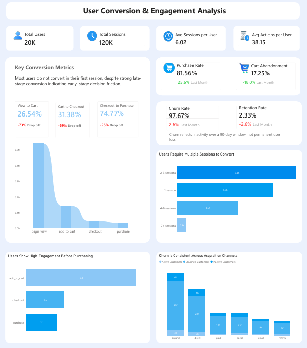
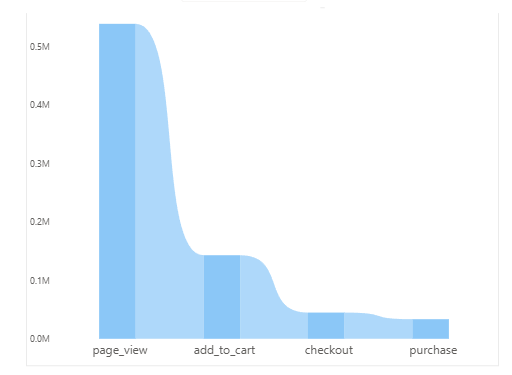
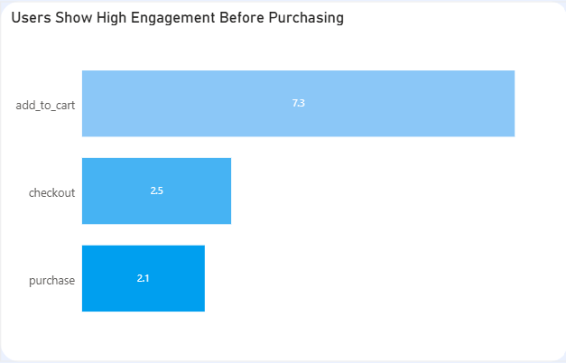
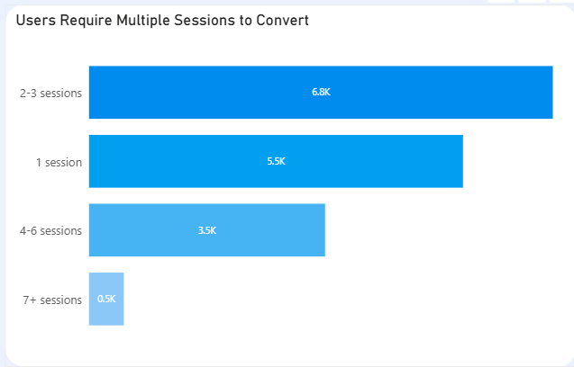
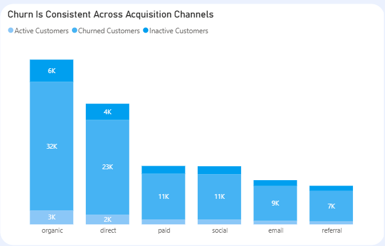

# Product Analytics: User Behavior, Conversion & Engagement

---

## Background and Overview

As a data analyst embedded within a product-led growth environment, my goal with this project was to move beyond surface-level metrics and build a clear, evidence-based picture of how users actually behave across the full product lifecycle.

The business had a simple but pressing question: **why aren't more users converting, and why do the ones who do eventually stop coming back?** My job was to find out.

Using event-level data spanning user sessions, product interactions, purchases, and reviews, I structured this analysis around four core areas:

- **Funnel & Conversion Efficiency** — where do we lose people, and how badly?
- **Engagement Behavior** — what does a user do before they buy?
- **Retention & Repeat Purchase** — are we building habitual users or one-time buyers?
- **Churn Analysis** — is this a product problem, a channel problem, or something else?

The outputs are intended to support decision-making across Product, Marketing, and Growth teams — giving each function a shared understanding of where the real leverage points are.

Insights and recommendations are provided on the following key areas:

- Funnel & Conversion Efficiency
- Engagement Behavior
- Retention & Repeat Purchase
- Churn Analysis

The SQL queries used to set up and load the database can be found [here](sql_load/).

Targeted SQL queries addressing specific business questions are organised by theme [here](analyses/).

An interactive Power BI dashboard used to report and explore user behaviour trends can be found [here](assests/product_analysis_dashboard.png).

---

## Data Structure Overview

The company's database was built from seven source CSV files loaded via the `sql_load/` pipeline. The data covers the full customer lifecycle — from account creation through browsing, purchasing, and reviewing. The core tables used in this analysis are as follows:

**`customers`** — one row per user. Contains demographic and acquisition data including the channel through which the user was acquired and the device type they use. Used for churn segmentation and channel analysis.

**`events`** — the atomic activity table. Every user action is logged here: `page_view`, `add_to_cart`, `checkout`, and `purchase`. This is the primary source for funnel and conversion analysis.

**`sessions`** — links events to users via `session_id` and `customer_id`, enabling us to count how many sessions a user has before converting and measure engagement depth per visit.

**`orders`** — one row per completed transaction. Used for purchase timing analysis, including time between first and second purchase.

**`order_items`** — line-item detail for each order. Supports product-level analysis and repeat purchase patterns.

**`products`** — product catalogue. Used to join product context to event and order data.

**`reviews`** — customer-submitted ratings and feedback. Used to assess product satisfaction and cross-reference against churn behavior.

Together, these tables allow us to answer both volume questions ("how many users dropped off?") and behavioral questions ("what did users do before they converted?").

---

## Executive Summary

*Power BI dashboard showing funnel performance, user behaviour, and retention trends*

The core finding of this analysis is this: **we do not have a checkout problem — we have a consideration problem.** Roughly 73% of users who view a product page never add anything to their cart, while users who do reach the cart convert at a strong rate with only ~17% abandonment. Beyond conversion, the data reveals a product with genuinely satisfied users (majority 4–5 star reviews) who simply do not feel urgency to act quickly or return frequently — and churn, defined as 90+ days of inactivity, is consistent across all acquisition channels and device types, pointing to the product experience rather than marketing as the root cause of disengagement.

---

## Insights Deep Dive

### Funnel & Conversion Efficiency

**The biggest drop in the funnel happens at the very top.** Approximately 73% of users who land on a product page leave without adding anything to their cart. This is by far the largest loss point in the entire funnel and dwarfs every other drop-off stage.

**Once users add to cart, they almost always buy.** Cart abandonment sits at ~17%, which is a healthy rate. The checkout experience is working — users who express purchase intent follow through. This means checkout optimization is a low-priority investment compared to the top-of-funnel problem.

**The decision stage, not the transaction stage, is where confidence breaks down.** Users are likely arriving, browsing, and leaving without feeling confident enough to act. This points to unclear value proposition or insufficient social proof on product pages rather than any friction in the purchase flow itself.

---

### Engagement Behavior

**Users are genuinely active in-session, but slow to commit.** Users perform multiple interactions per session, yet only ~34% convert in a single visit. High in-session engagement exists — but it is not translating to immediate purchase decisions.

**Most users require multiple sessions before converting.** ~66% of converting users return for more than one session before making a purchase, with many needing 4 or more visits. Purchases are considered, not impulsive — users are likely comparison shopping or waiting for a trigger to act.

**Engagement is the strongest leading indicator of conversion.** Users who interact deeply with the product are pre-qualified buyers. There is a strong correlation between in-session engagement depth and likelihood to eventually purchase, making engagement a key metric to monitor and optimize for.

---

### Retention & Repeat Purchase

**Repeat purchase behavior exists — but it is slow and need-driven.** The majority of users do return for a second purchase, which signals product satisfaction. However, the median time to second purchase is ~45 days, suggesting usage is occasion-based rather than habitual.

**Users return when they need something, not because the product keeps them coming back.** There is no evidence of habit loops or regular engagement driving return visits. The product has earned loyalty but has not yet earned a regular place in users' routines, which caps the frequency ceiling on repeat revenue.

---

### Churn Analysis

**Churn is uniformly distributed — this is a product problem, not a channel problem.** Churn rates show no meaningful variation by acquisition source or device type. A user acquired through paid search churns at roughly the same rate as one who came through organic or direct traffic.

**Churn reflects inactivity, not dissatisfaction.** Churn is defined as 90+ days of inactivity — it does not necessarily reflect a negative experience. Combined with the positive review data (majority 4–5 stars), this suggests users are not leaving because the product failed them; they are drifting away because nothing pulled them back.

**Re-engagement, not acquisition, is the retention lever.** Since churn is channel-agnostic and the product quality signal is strong, investing more in acquisition will not solve the retention problem. The opportunity lies in building touchpoints that bring satisfied-but-quiet users back before they hit the 90-day mark.

---

## Recommendations

Based on the insights and findings above, we would recommend the Product and Growth teams to consider the following:

**73% of users drop off before adding to cart — fix the consideration stage first.** The product page is not converting interest into intent. Audit pages for clarity of value proposition, add trust signals (reviews, return policy, social proof), and A/B test layouts that surface persuasive information earlier. This is the single highest-ROI intervention available.

**66% of users need multiple sessions to convert — build a session-continuity strategy.** Implement behaviorally triggered email or push reminders ("still thinking about X?") and introduce low-friction features like wishlists or saved items to keep users connected to their intent between visits. Retargeting should be specific and recency-focused, not generic.

**The median second purchase takes ~45 days — create reasons to return sooner.** Post-purchase sequences (care guides, complementary products, curated recommendations) and loyalty mechanics can compress the return window and shift users from need-based to habitual buyers without relying on discounts.

**Churn is consistent across all channels — stop treating it as an acquisition problem.** Build a 30/60/90-day re-engagement flow for users going quiet. Segment inactive users and test win-back approaches: value-led, curiosity-led, and social proof-led. Monitor time-to-second-session as an early churn warning signal.

**The checkout flow is working — protect it, don't over-optimize it.** Cart abandonment at ~17% is healthy. Resist the temptation to invest heavily in checkout improvements when the real volume loss is happening at the top of the funnel.

---

## Assumptions and Caveats

Throughout the analysis, multiple assumptions were made to manage challenges with the data. These assumptions and caveats are noted below:

- Churn is defined as 90+ days of inactivity. This is a threshold assumption — users classified as churned may simply be slow returners, particularly given the observed ~45 day median repurchase window.
- Sessions with no associated `customer_id` in `sessions_dim` were excluded from user-level analysis, as they could not be attributed to an individual user.
- The funnel analysis treats each event type as mutually exclusive stages. Users who skipped a stage (e.g., went directly from `page_view` to `purchase`) are counted at the stage they reached, not intermediate ones.
